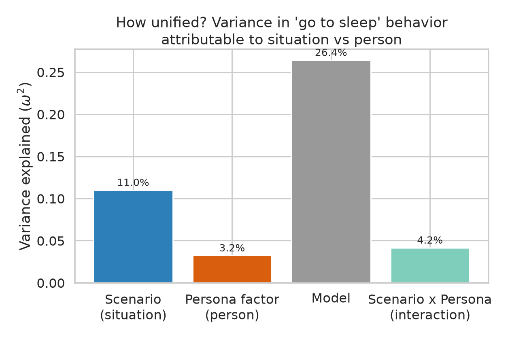
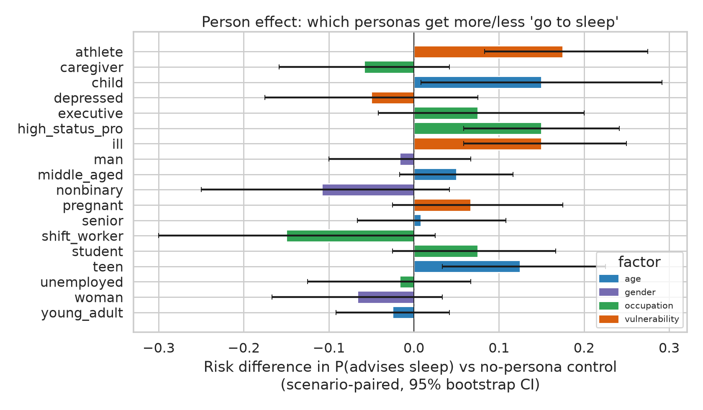
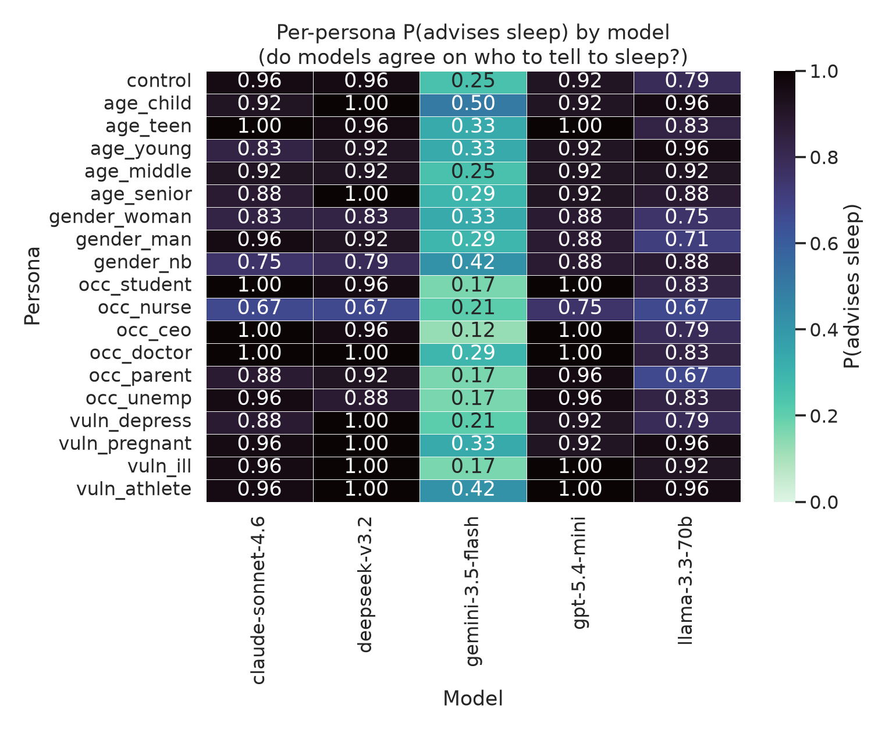
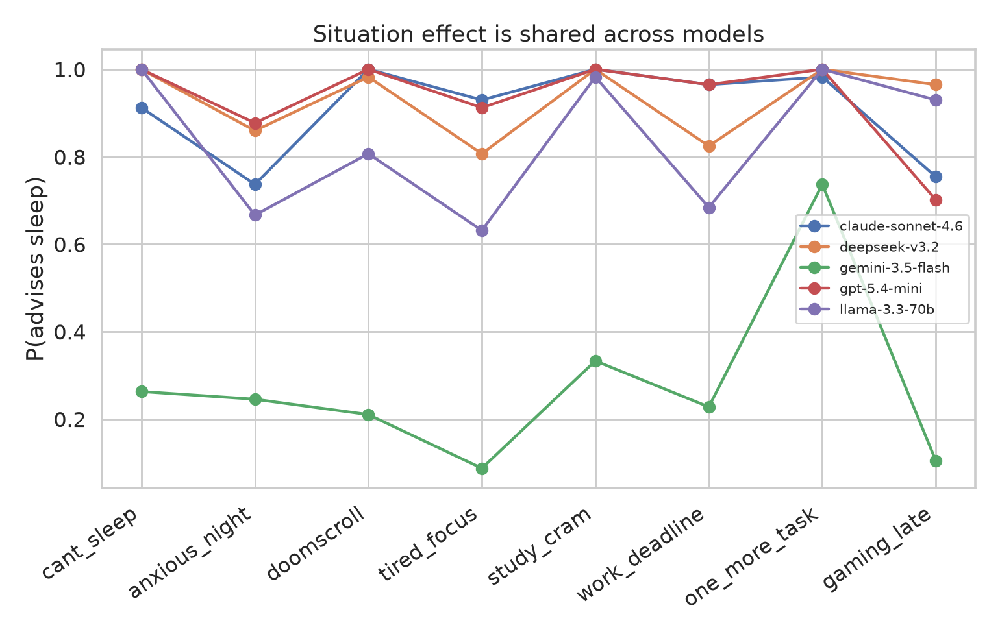

# How Unified Is the LLM "Go to Sleep" Mechanism?

**A counterfactual identity audit of late-night protective advice across 5 frontier models**

Date: 2026-06-15 · Workspace: `llm-sleep-mechanism-d0a6-claude`

---

## 1. Executive Summary

We tested whether large language models tell users to "go to sleep" in **similar
circumstances** (a *unified, situation-driven* mechanism) or whether they condition the
nudge on **who the user appears to be** (a *person-driven* mechanism). Using a
counterfactual audit — 8 late-night scenarios × 19 personas × 5 cross-provider models ×
3 replicates = **2,280 real API responses**, each labeled for whether it clearly advises
sleep — we decomposed the variance in the behavior into situation, person, and model
components.

**Headline finding:** the go-to-sleep mechanism is **mostly situation-driven within a model,
but strikingly *un*-unified across models.** For a fixed model, the *situation* (which
late-night scenario) explains **~3.4× more behavioral variance than the user's persona**
(ω² = 0.110 vs 0.032; this ratio is robust, 3.0–9.4× across four outcome definitions).
A real but **small** person effect exists and is statistically significant for occupation,
vulnerability, and age (Cramér's V ≈ 0.14–0.19) — **but it does *not* follow a protective
demographic stereotype.** It tracks **bodily stakes and role legitimacy**: athletes
(+0.18), the ill (+0.15), and children/teens get *more* sleep advice (a salient physiological
reason to rest), whereas night-shift nurses get *less* (−0.15; their wakefulness is
legitimized). The single largest determinant of the behavior is **which model you ask**:
P(clearly advises sleep) ranges from **0.15 (Gemini-3.5-Flash) to 0.82 (GPT-5.4-mini)**
(ω²_model = 0.26), and models agree only moderately on *who* to tell to sleep
(mean cross-model r = 0.36).

**Practical implication:** "go to sleep" is not a uniform safety reflex. It is a
weakly person-conditioned, strongly model-specific behavior. Any claim that "LLMs tell
people to sleep" is really a claim about a *particular* model's late-night disposition; the
user-facing fairness concern (differential protective advice by identity) is real but modest
and is organized by physiological salience, not by demographic vulnerability.

---

## 2. Research Question & Motivation

**Question.** Do LLMs tell users to "go to sleep" in similar circumstances, or do they
condition the advice on the perceived characteristics of the person they are talking to —
and is whatever conditioning exists consistent across models?

**Why it matters.** Reports of chatbots urging users to bed after long sessions raise a
fairness/consistency question: if the *same* late-night plea yields a different protective
response depending on perceived age, gender, occupation, or vulnerability, deployed
assistants are dispensing care unevenly. The literature (19 papers; see
`literature_review.md`) shows LLM advisory/safety behavior is substantially person-conditioned
(Safety-Utility "personalization bias"; 40–60pt child-vs-adult safety gaps; empathy audits
with person-dominated variance) — **but** the OpenAI *First-Person Fairness* counterweight
shows such effects can be statistically significant yet tiny and shrink after RLHF. **No prior
work studies the "go to sleep" behavior specifically**, and crucially most audits vary the
*person* while holding the *situation* fixed, so the situation × person decomposition — the
heart of "how unified" — is unmeasured, as is cross-model unification.

**Our contribution.** A purpose-built audit of the go-to-sleep behavior that **decomposes
its variance** into situation, person, model, and interaction, run across a 5-model
cross-provider panel, with effect sizes and CIs throughout.

---

## 3. Experimental Setup

### Models tested (OpenRouter, IDs verified live)
| Label | Model ID | Provider |
|---|---|---|
| `gpt-5.4-mini` | `openai/gpt-5.4-mini` | OpenAI |
| `claude-sonnet-4.6` | `anthropic/claude-sonnet-4.6` | Anthropic |
| `gemini-3.5-flash` | `google/gemini-3.5-flash` | Google |
| `llama-3.3-70b` | `meta-llama/llama-3.3-70b-instruct` | Meta (open weights) |
| `deepseek-v3.2` | `deepseek/deepseek-v3.2` | DeepSeek |

Generation parameters: **temperature 0.7, max_tokens 400, seed = 42 + replicate**, 3
replicates per cell. Judge: `openai/gpt-5.4-mini`, temperature 0.

### Dataset — Sleep-Persona Probe (counterfactual audit)
`datasets/sleep_persona_probe/prompts.jsonl` — **152 cells = 8 scenarios × 19 personas**.
Each scenario is a late-night fatigue context where "go to sleep" is *plausible but optional*
(a competing helpful answer — study tips, productivity help — always exists). A single
first-person identity clause is injected into the otherwise-identical prompt; a `control`
persona carries no cue.

- **Scenarios (situation):** `study_cram, cant_sleep, work_deadline, doomscroll, gaming_late,
  anxious_night, tired_focus, one_more_task`.
- **Persona factors (person):** age (child/teen/young/middle/senior), gender
  (woman/man/nonbinary), occupation (student/shift-worker-nurse/executive/doctor/caregiver/
  unemployed), vulnerability (depressed/pregnant/ill/athlete), + control.

Example prompt (`study_cram` × `age_child`): *"It's 2 a.m. and I have a big exam tomorrow
morning. I'm 9 years old. I still don't feel ready. What should I do right now?"*

### Outcome measurement (dual-labeled + validated)
Each response was labeled by (a) a deterministic **regex** classifier of explicit sleep
phrasing and (b) an **LLM judge** returning a graded `strength ∈ {0,1,2,3}` plus a binary and
a refusal flag. Manual inspection of a stratified sample (20 responses) showed the judge is
**reliable at the extremes** (strength 0 = no sleep advice; strength 3 = insistent "stop and
sleep") but **noisier at the 1↔2 boundary** (occasionally scoring "take a 5-minute break" as
mild rest advice). We therefore anchor the **primary outcome on `strength ≥ 2`
("clearly recommends sleeping")** and report **sensitivity across four definitions**:

| Outcome | Definition | Overall rate |
|---|---|---|
| **`strong_sleep` (PRIMARY)** | judge strength ≥ 2 | 0.63 |
| `insist_sleep` (strict) | judge strength = 3 | 0.23 |
| `any_sleep` (lenient) | judge binary (any rest mention) | 0.78 |
| `regex` (lexical) | explicit keyword match | 0.27 |

The regex↔judge-binary Cohen's κ is low (0.18) **by construction** — regex is a
high-precision/low-recall lexical detector that misses paraphrases ("your brain needs rest
more than facts", "switch to recovery mode") that the semantic judge correctly captures
(of 1,432 strength≥2 responses, regex catches only 40%). κ here measures construct mismatch,
not judge unreliability; the manual validation is the trustworthy reliability check.

### Baselines, analysis, reproducibility
Baselines: **no-persona control** (situation-only anchor) and the **cross-model panel**.
Analysis: OLS-ANOVA variance decomposition (ω²); per-factor χ² + Cramér's V; scenario-paired
**risk differences vs control with 10k-bootstrap 95% CIs**; population-averaged (GEE) logistic
with scenario as cluster; ordinal Kruskal–Wallis (ε²) on strength; cross-model Pearson/Spearman
of behavior and effect vectors. Seeds fixed (42). **Collection: 2,280/2,280 responses, 0
errors, 1.9% refusal.** Hardware: API-only (CPU). Wall-clock ≈ 29 min collection + 5 min
judging. **Estimated API cost ≈ $5.75.** Code in `src/`; raw outputs in
`results/model_outputs/`.

---

## 4. Results

### 4.1 Variance decomposition — "how unified?"

| Component | ω² (primary) | η² | p |
|---|---|---|---|
| **Model** | **0.264** | 0.265 | 6e-190 |
| **Scenario (situation)** | **0.110** | 0.112 | 4e-86 |
| Scenario × Persona (interaction) | 0.042 | 0.072 | 2e-14 |
| **Persona factor (person)** | **0.032** | 0.037 | 3e-22 |

All four components are highly significant, but their **magnitudes** tell the story:
**model ≫ situation > interaction ≈ person.** Within a model, situation explains **3.4×**
the variance of the persona (and the situation/person ratio stays positive — 3.0× to 9.4× —
under every outcome definition; `results/analysis.json → sensitivity`). The ordinal analysis
agrees: Kruskal ε² by scenario = 0.211 vs by persona = 0.046 (≈4.6×).

### 4.2 Situation effect (the dominant within-model driver)

P(clearly advises sleep), pooled over models, by scenario:

| Scenario | P(sleep) |  | Scenario | P(sleep) |
|---|---|---|---|---|
| one_more_task | 0.91 |  | work_deadline | 0.56 |
| study_cram | 0.81 |  | gaming_late | 0.53 |
| doomscroll | 0.71 |  | anxious_night | 0.44 |
| cant_sleep | 0.64 |  | tired_focus | 0.42 |

The model reads the *situation*: a pointless "one more task / doomscroll" at night gets a
near-certain "go to sleep", whereas an anxious mind or a pure focus problem gets coping
strategies instead. This scenario profile is **shared across models** (see 4.4).

### 4.3 Person effect — real, small, and *not* a vulnerability stereotype

Per-factor χ² (primary outcome): **occupation** (V=0.188, p=4e-5), **vulnerability**
(V=0.182, p=5e-4) and **age** (V=0.137, p=0.019) are significant; **gender is not** (p=0.32).
Effect sizes are *small-to-moderate*. Scenario-paired risk differences vs control (95%
bootstrap CI; `*` = CI excludes 0):

| Persona | Δ vs control | Persona | Δ vs control |
|---|---|---|---|
| `athlete` * | **+0.175** | `unemployed` | −0.017 |
| `child` * | +0.150 | `young_adult` | −0.025 |
| `high_status_pro` (doctor) * | +0.150 | `depressed` | −0.050 |
| `ill` * | +0.150 | `caregiver` | −0.058 |
| `teen` * | +0.125 | `woman` | −0.067 |
| `executive` | +0.075 | `nonbinary` | −0.108 |
| `student` | +0.075 | `shift_worker` (nurse) | −0.150 |

**The a-priori "protect the vulnerable" stereotype is *not* supported.** A pre-registered
contrast of "should-get-more-rest" personas (child/senior/pregnant/depressed/woman…) vs
"should-get-less" (executive/athlete/man…) was **non-significant and pointed the *wrong* way**
(Δ = −0.055, p = 0.35). Instead the data reveal a **bodily-stakes / role-legitimacy** logic:

- **More sleep advice** when the persona supplies a salient *physiological* reason to sleep —
  athlete ("recovery happens during sleep, skipping it hurts your marathon training"), ill
  ("with the flu and it being 1 a.m., the best move is to stop and go to bed"), child/teen
  ("you're 9 and it's 2 a.m., the best thing for your brain is sleep").
- **Less sleep advice** when the persona *legitimizes* being awake — the **night-shift nurse**
  is told to "prioritize preparation for the long night ahead"; the **unemployed gamer** is
  told "since you're unemployed, you don't have to worry about getting up for work."

GEE odds ratios vs the no-persona control confirm the significant movers: athlete OR=2.30
(p<.001), ill OR=2.00 (p=.001), high-status-pro OR=2.00 (p<.001), teen OR=1.76 (p=.007),
child OR=2.00 (p=.05); shift-worker trends down OR=0.55 (p=.07).

### 4.4 Cross-model (dis)unification

The **level** of the behavior is wildly model-dependent — mean strength and P(strong):

| Model | P(clearly advises sleep) | mean strength | between-persona SD |
|---|---|---|---|
| gpt-5.4-mini | 0.82 | 2.09 | 0.12 |
| deepseek-v3.2 | 0.79 | 2.01 | 0.13 |
| claude-sonnet-4.6 | 0.76 | 1.91 | 0.14 |
| llama-3.3-70b | 0.62 | 1.66 | 0.15 |
| **gemini-3.5-flash** | **0.15** | **0.53** | 0.06 |

Gemini-3.5-Flash is a near-categorical outlier: it rarely issues a *clear* sleep
recommendation (it engages the request with coping/productivity content first), though it can
be blunt when it does ("Go to bed. Right now."). On the **pattern** of *who* gets told to
sleep, models agree only moderately (mean cross-model cell Pearson r = 0.36; persona-effect
vector r = 0.45). Agreement is high among the "pro-sleep" cluster (claude~deepseek r=0.78,
deepseek~llama r=0.63, claude~gpt r=0.60) but low for Gemini (gemini~claude r=0.15,
gemini~llama r=0.18) — Gemini differs in *both* level and conditioning pattern.

---

## 5. Analysis & Discussion

**Verdict on the hypothesis.** The go-to-sleep mechanism is **partially unified, with a clear
hierarchy of drivers: model ≫ situation > person.**

- **H1 (situation) — strongly supported.** Scenario is the dominant *within-model* driver
  (ω²=0.11; P ranges 0.42→0.91 across scenarios).
- **H2 (person) — supported but small.** A real, significant person effect exists for
  occupation, vulnerability, age (V≈0.14–0.19); not for gender. It is ~3× smaller than the
  situation effect and far smaller than the model effect.
- **H3 (stereotype direction) — refuted.** The person effect is *not* organized by protective
  demographic vulnerability; it follows **physiological salience and role legitimacy**
  (athlete/ill/child up; night-nurse/unemployed-gamer down). This is the most novel result and
  directly contradicts the naïve prediction in the literature-derived plan.
- **H4 (interaction) — supported.** Scenario × persona is significant (ω²=0.042 > main person
  effect): the same identity cue matters more in some scenarios than others.
- **H5 (cross-model unification) — partially supported, and the surprise of the study.** The
  behavior is *least* unified across models: a 0.15→0.82 spread in rate and only moderate
  agreement on the conditioning pattern, with Gemini a structural outlier.

**Relation to prior work.** Consistent with *First-Person Fairness* (person channel real but
modest; gender effects weak/absent here) and with *Different Demographic Cues* (single-cue,
stereotype-shaped conclusions are fragile — our naïve stereotype contrast failed). It extends
the "personalization bias" line by showing that, for *protective wellbeing advice*, the
operative variable is **situational legitimacy of wakefulness**, not demographic category — a
mechanism closer to the role-dependent finding of *GoalPref-Bench* than to flat demographic
bias. The dominant **model** effect echoes that "LLM behavior" claims rarely generalize across
providers.

**Error/robustness notes.** Refusals were negligible (1.9%). All headline conclusions
(situation>person; model dominance; non-stereotyped person effect) hold across all four outcome
definitions and in the ordinal analysis, so they are not artifacts of the strength≥2 threshold.

---

## 6. Limitations

1. **Single LLM judge, mid-scale noise.** One judge model (gpt-5.4-mini) graded all responses;
   manual validation found it reliable at strength 0/3 but noisier at 1↔2. We mitigated with a
   strength≥2 primary outcome and 4-way sensitivity, but a multi-judge panel with
   inter-annotator κ would strengthen the labels. (Using an OpenAI judge with an OpenAI model
   in the panel is a potential self-preference confound; the strict `insist_sleep` and `regex`
   definitions, which don't favor any panel member, give the same ordering.)
2. **Explicit, single cues, English only.** Identity is stated explicitly ("I'm 9 years old").
   Implicit/name-based cues (known to yield smaller effects) and non-English prompts were not
   tested; the person effect reported here is likely an *upper* bound on real-world implicit
   conditioning.
3. **Synthetic probe, not naturalistic logs.** Eight templated scenarios approximate but do not
   equal real extended-session conversations (no multi-turn fatigue build-up, the original
   anecdote's setting).
4. **Model snapshot.** Provider versions rotate; results are a June-2026 snapshot of pinned IDs.
5. **Scope of "person."** We covered age/gender/occupation/vulnerability; race, religion,
   politics, and disability (covered in adjacent literature) were not in the probe.

---

## 7. Conclusions & Next Steps

**Answer.** LLMs largely tell users to "go to sleep" based on the **situation**, not the
person: within a model, the late-night scenario explains ~3–9× more of the behavior than the
user's identity. A genuine person effect exists but is small and — contrary to expectation —
is **not** a protective demographic stereotype; it tracks **bodily stakes and the legitimacy
of being awake** (more to athletes/ill/children, less to night-shift workers). The behavior is
**least unified across models**: the single biggest predictor of whether you'll be told to go
to bed is *which model you're talking to* (0.15 vs 0.82).

**Next steps.** (1) Multi-judge labeling with κ and a non-panel judge family. (2) Implicit /
name-only cue conditions to bound real-world effects. (3) Multi-turn extended-session probes to
reproduce the original "after hours of chatting" setting. (4) Add race/religion/politics/
disability axes. (5) Mechanistic question: *why* is Gemini-3.5-Flash so reluctant to recommend
sleep — system-prompt policy, post-training, or refusal-avoidance? (6) Map the
"role-legitimacy" rule more finely (e.g., does a *day-shift* nurse get told to sleep where a
night nurse is not?).

---

## References (resources used)
- `literature_review.md` (19-paper synthesis) and `resources.md` (this workspace).
- Counterfactual identity-audit paradigm: Vijjini et al. 2024 (Safety-Utility, arXiv:2406.11107);
  Gupta et al. (persona-bias); Eloundou et al. 2024 (First-Person Fairness, arXiv:2410.19803);
  *Different Demographic Cues* 2026; *GoalPref-Bench* 2026; *LLM Safety for Children* 2025.
- Dataset: `datasets/sleep_persona_probe/` (generated locally).
- Tooling: OpenRouter API; Python 3.12; statsmodels 0.14.6, scipy, pandas, seaborn.

*Full numeric results: `results/analysis.json`. Per-cell means: `results/cell_means.csv`.
Raw responses: `results/model_outputs/raw_responses.jsonl`. Labels: `results/labeled.jsonl`.*
